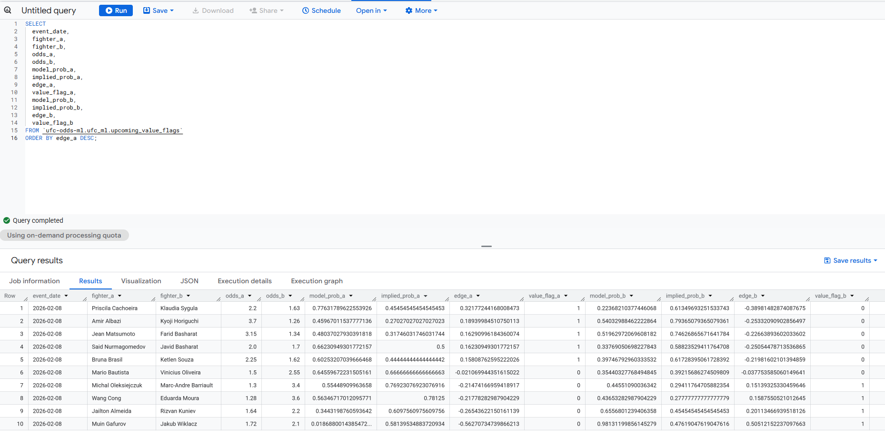

# UFC Odds ML Pipeline

Goal: Predict UFC fight outcomes and flag potential value bets using historical data.
Non-goals: Not a production betting system; no injury/camp/short-notice data.

Stack: BigQuery, dbt, Airflow, Python.

## Architecture
See `docs/architecture.md`.

## Repo layout
- dags/            Airflow DAGs
- dbt/             dbt project stub
- scripts/         One-off helpers (load, export)
- data/            Local raw data (gitignored)
- notebooks/       EDA and prototyping
- docs/            Diagrams and notes

## Step 1: Data intake (scripted)
Prereqs:
- Kaggle account + API token in %USERPROFILE%\.kaggle\kaggle.json
- Kaggle CLI: pip install kaggle
- Google Cloud SDK (bq CLI) + gcloud auth login

Run:
  .\scripts\load_kaggle_to_bq.ps1 -ProjectId ufc-odds-ml -Dataset ufc_raw -Location EU -Replace

Notes:
- This downloads the dataset and loads each CSV into BigQuery tables.
- Use -SkipDownload if you already downloaded the files into data/raw.

## Model results (baseline, BigQuery ML)
Goal: quick, safe-features baseline without leakage.

Data split (event_date):
- Train: <= 2021-12-31 (6307 fights)
- Valid: 2022-01-01 .. 2023-12-31 (1010 fights)
- Test: >= 2024-01-01 (873 fights)

Features used (known before the fight):
- division, title_fight, total_rounds
- r/b age, height, reach, stance (imputed) + missing flags

Valid metrics (BQML logistic regression):
- accuracy 0.510, ROC-AUC 0.601
- precision 0.682, recall 0.302, F1 0.418
- log_loss 0.707

Test metrics:
- accuracy 0.530, ROC-AUC 0.631
- precision 0.664, recall 0.299, F1 0.413
- log_loss 0.690

Test confusion (r_win_label):
- TP 144, FP 73, TN 319, FN 337

Calibration (test):
- 0.3-0.5 bins: model is under-confident
- 0.6-0.8 bins: model is over-confident
- very small bins (n small) are unstable

Rolling model results (time-aware features):
Valid metrics:
- accuracy 0.534, ROC-AUC 0.624
- precision 0.710, recall 0.341, F1 0.460
- log_loss 0.710

Test metrics:
- accuracy 0.558, ROC-AUC 0.644
- precision 0.706, recall 0.339, F1 0.458
- log_loss 0.692

Note: Rolling features improve accuracy/ROC-AUC vs. the safe baseline.

Rolling calibration (test):
- 0.3-0.5 bins: model is under-confident
- 0.6-0.8 bins: model is over-confident
- very small bins (n small) are unstable

## Feature weights (rolling model)
Notes from ML.WEIGHTS:
- Missingness flags are still strong predictors (e.g., reach/age missing).
- Rolling takedown rate (r_td_lpm_imputed) shows signal.
- Division/tournament categories dominate the categorical weights and can be unstable due to sparsity.

## How to reproduce results
Run the SQL files in order (BigQuery UI or CLI):

Data + staging:
- Run `sql/01_*` through `sql/21_*` in order.

BQML baseline:
- Run `sql/22_*` through `sql/34_*` in order.

Rolling features + model:
- Run `sql/35_*` through `sql/58_*` in order.
Note: files named `*_sample_*` or `*_check_*` are optional diagnostics.

Upcoming predictions (optional):
- Run `sql/59_*` through `sql/64_*` in order.
See `sql/README.md` for a concise index.

## dbt (optional)
Minimal dbt project lives in `dbt/`. See `dbt/README.md` and `dbt/profiles.example.yml`.

## Airflow (optional)
`dags/ufc_bq_pipeline.py` is a lightweight DAG stub that runs key SQL files in order.

## Upcoming fight predictions (manual)
1) Fill in `templates/upcoming_fights_template.csv` with the next event.
2) Load it into BigQuery table `ufc_ml.upcoming_fights_manual` (use `sql/59_create_upcoming_table.sql` first).
3) Run `sql/60_create_upcoming_features.sql`.
4) Run `sql/61_predict_upcoming.sql`.
5) Run `sql/62_create_upcoming_value_flags.sql`.
6) Preview with `sql/64_sample_upcoming_value_flags.sql`.

Name matching tips:
- If a fighter name does not match, set `fighter_a_id` / `fighter_b_id` manually.
- Use `sql/63_check_upcoming_name_matches.sql` to find missing IDs.
Odds input notes:
- Use decimal odds.
- `fighter_a` / `odds_a` = left side of your source list.

Value flags column definitions:
- `model_prob_a` / `model_prob_b`: model-estimated win probability for fighter A/B.
- `implied_prob_a` / `implied_prob_b`: implied probability from decimal odds (`1 / odds`).
- `edge_a` / `edge_b`: model_prob minus implied_prob (positive = model favors that side).
- `value_flag_a` / `value_flag_b`: 1 if edge >= 0.05, else 0.

Latest upcoming value flags (2026-02-08):

- Value flags for fighter A: Priscila Cachoeira, Amir Albazi, Jean Matsumoto, Said Nurmagomedov, Bruna Brasil.
- Value flags for fighter B: Marc-Andre Barriault, Eduarda Moura, Rizvan Kuniev, Jakub Wiklacz.
- No value flag: Mario Bautista vs Vinicius Oliveira.
Notes:
- Jakub Wiklacz has no history in the dataset; this prediction is high-uncertainty.
- Rolling model probabilities are not calibrated yet; "value flags" likely overestimate edges.
- Odds include bookmaker margin; implied probabilities should be normalized (vig removed) for cleaner comparisons.
- Full details: `docs/upcoming_value_flags.md`.

## Optional next steps
- Expand dbt models beyond the staging stub.
- Add automated retraining schedule in Airflow.
- Calibrate probabilities and remove vig from odds.
