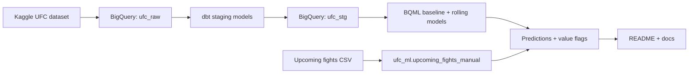

# Architecture

```mermaid
flowchart LR
  A[Kaggle UFC dataset] --> B[BigQuery: ufc_raw]
  B --> C[dbt staging models]
  C --> D[BigQuery: ufc_stg]
  D --> E[BQML baseline + rolling models]
  E --> F[Predictions + value flags]
  F --> G[README + docs]

  H[Upcoming fights CSV] --> I[ufc_ml.upcoming_fights_manual]
  I --> F
```
